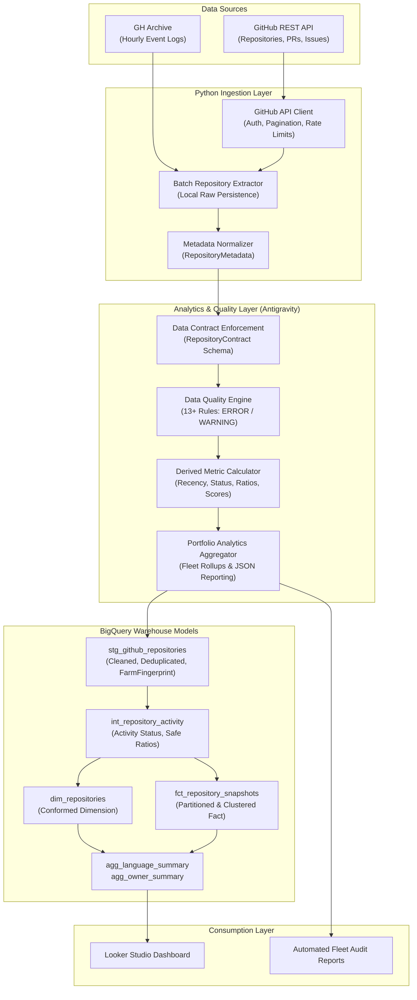

# DevFlow Intelligence

[](https://www.python.org/downloads/)
[](https://github.com/astral-sh/ruff)
[](https://docs.pytest.org/)
[](https://cloud.google.com/bigquery)

**DevFlow Intelligence** is a production-grade batch Data Engineering and Analytics platform designed to extract, validate, transform, and analyze public software engineering development activity from GitHub.

It provides engineering leadership and technical leads with reliable, standardized, and auditable metrics regarding repository maintenance health, developer engagement, and technology stack distributions across multi-repository fleets.

---

## Architecture Overview



---

## Key Highlights & Portfolio Value

1. **Strict Data Contract Architecture**: Enforces explicit schema types, nullability boundaries, and timezone awareness (`UTC`) via `RepositoryContract`, insulating downstream models from upstream API drift.
2. **Programmatic Data Quality Gate**: Non-destructive `DataQualityEngine` evaluating 13+ record- and batch-level rules with clear severity tiers (`ERROR` vs `WARNING`), preventing corrupt records from polluting analytical marts.
3. **Deterministic Derived Metrics**: Recency calculations (`days_since_last_push`) and activity status mappings (`ACTIVE`, `STALE`, `INACTIVE`, `ARCHIVED`, `DISABLED`) execute deterministically relative to ingestion watermarks.
4. **Cloud Warehouse Readiness (Google BigQuery)**: Pre-built, optimized SQL models implementing staging deduplication with window functions, 64-bit `FARM_FINGERPRINT` surrogate keys, date partitioning (`PARTITION BY DATE(snapshot_timestamp)`), and clustering (`CLUSTER BY repository_id, language`).
5. **Dual-Team Autonomous Collaboration**: Designed under a strict isolation model where the Antigravity Team develops the analytics, contract, and quality foundation while Codex integrates the data platform.
6. **Zero-Dependency Core**: Analytics and data quality engines rely exclusively on Python standard library dataclasses, enums, and typing, guaranteeing lightning-fast offline test execution (< 1s for 95 tests).

---

## Business Problem & Metric Definitions

Engineering managers overseeing multiple repositories require centralized visibility into maintenance activity, pull request flows, and repository freshness. DevFlow Intelligence provides mathematically sound and defensible answers to core questions:

### 1. Activity Status Classification
* **`ACTIVE`**: Repository pushed within the last 90 days, not archived, not disabled.
* **`STALE`**: Repository pushed between 91 and 180 days ago.
* **`INACTIVE`**: Repository without pushes in > 180 days or without any recorded pushes.
* **`ARCHIVED`**: Explicitly marked archived by owner.
* **`DISABLED`**: Explicitly disabled repository.

### 2. Engagement & Technical Ratios
* **`fork_to_star_ratio`**: Measures community contribution tendency vs passive starring.
* **`issue_to_star_ratio`**: Identifies repositories with disproportionate issue backlogs relative to user base.
* **`community_interest_score`**: Weighted composite metric:
  $$\text{Score} = (\text{stars} \times 1.0) + (\text{forks} \times 2.0) + (\text{subscribers} \times 1.5)$$
* **`size_category`**: Standardized size tiering (`EMPTY`, `MICRO`, `SMALL`, `MEDIUM`, `LARGE`).

---

## Data Quality Framework

The pipeline implements an automated data quality gate distinguishing between fatal contract breaches and operational observations:

| Severity | Action | Examples |
|---|---|---|
| **`ERROR`** | Rejects or flags record as invalid; halts analytical promotion | Negative stars/forks, invalid repository ID, empty owner/name, identity mismatch between full_name and owner, missing `extracted_at`, batch duplicates |
| **`WARNING`** | Records operational observation; allows processing | `pushed_at` earlier than `created_at`, non-standard URL scheme, empty repository (0 KB) |
| **`INFO`** | Diagnostic tracking | Default values applied, volume distributions |

Run the quality diagnostic suite:
```powershell
python scripts/check_data_quality.py
```

---

## BigQuery SQL Warehouse Models

Located in `analytics/sql/`:

* **`staging/stg_github_repositories.sql`**: Type-casts raw JSON fields, applies null coalescing, generates `repository_surrogate_key` via `FARM_FINGERPRINT`, and eliminates duplicate snapshots using `QUALIFY ROW_NUMBER() OVER (PARTITION BY repository_id ORDER BY extracted_at DESC) = 1`.
* **`intermediate/int_repository_activity.sql`**: Calculates temporal delays and ratios with `SAFE_DIVIDE`.
* **`marts/dim_repositories.sql`**: Conformed repository dimension table clustered by `(language, visibility, owner_login)`.
* **`marts/fct_repository_snapshots.sql`**: Daily snapshot fact table partitioned by `DATE(snapshot_timestamp)` and clustered by `(repository_id, language)`.
* **`marts/agg_language_summary.sql`**: Aggregated fleet metrics segmented by programming language.
* **`marts/agg_owner_summary.sql`**: Aggregated portfolio metrics segmented by repository owner.

---

## Repository Structure

```text
devflow-engineering-analytics/
├── analytics/                      # Antigravity Analytics & Quality Layer
│   ├── contracts/                  # Schema contract definitions & validation
│   │   ├── repository.py           # RepositoryContract & RepositoryRecord
│   ├── metrics/                    # Derived metric calculations & fleet aggregation
│   │   ├── calculator.py           # RepositoryMetricCalculator
│   │   ├── definitions.py          # RepositoryMetrics & ActivityStatus
│   │   └── summary.py              # PortfolioAnalyticsAggregator & PortfolioSummary
│   ├── quality/                    # Programmatic Data Quality Framework
│   │   ├── engine.py               # DataQualityEngine
│   │   ├── models.py               # QualityResult, QualityIssue, QualitySeverity
│   │   └── rules.py                # 13+ validation rules (Record & Batch)
│   ├── sql/                        # BigQuery-ready SQL warehouse models
│   │   ├── staging/                # stg_github_repositories.sql
│   │   ├── intermediate/           # int_repository_activity.sql
│   │   ├── marts/                  # dim_repositories, fct_snapshots, aggs
│   │   └── README.md               # SQL modeling & optimization guide
│   └── service.py                  # High-level analytical facade API
├── docs/                           # Technical architecture & project documentation
│   ├── analytics/                  # Deep-dive analytics, DQ, and warehouse guides
│   ├── architecture/               # System architecture & ADRs
│   └── project_scope.md            # Business problem & project scope
├── ingestion/                      # GitHub API extraction client & metadata
│   ├── common/                     # Environment, config, logging
│   └── github/                     # Client, service, batch, metadata
├── scripts/                        # Operational CLI diagnostic scripts
│   ├── check_analytics.py          # Analytics pipeline diagnostic runner
│   ├── check_data_quality.py       # Data quality validation diagnostic runner
│   ├── check_environment.py        # Python runtime & dependencies verification
│   └── check_github_connection.py  # GitHub API connectivity test
├── tests/                          # Automated pytest suite (95+ tests)
│   ├── test_analytics_*.py         # Analytics service & summary unit tests
│   ├── test_contract_*.py          # Data contract validation tests
│   ├── test_data_quality_*.py      # Data quality rule & engine tests
│   └── test_metrics_*.py           # Metric calculation & ratio tests
├── pyproject.toml                  # Pytest & Ruff configurations
└── README.md                       # Main project documentation
```

---

## Getting Started

### 1. Prerequisites
* Python $\ge 3.12$ (Tested on Python 3.14.6)
* Git

### 2. Environment Setup
```powershell
# Clone or navigate to the repository
cd C:\DataEngineering\devflow-antigravity

# Create and activate virtual environment
python -m venv .venv
.\.venv\Scripts\Activate.ps1

# Install development dependencies
python -m pip install -r requirements-dev.txt
```

### 3. Verify Environment & Diagnostics
```powershell
# Run environment verification
python scripts/check_environment.py

# Run analytics diagnostic
python scripts/check_analytics.py

# Run data quality test runner
python scripts/check_data_quality.py
```

### 4. Run Automated Test Suite
All tests execute without network calls, GitHub tokens, or cloud credentials:
```powershell
# Run pytest suite (95 tests passing)
python -m pytest

# Run Ruff linter and code formatter check
python -m ruff check .
python -m ruff format --check .
```

---

## Security & Reliability Principles

* **Zero Secret Exposure**: The repository strictly excludes credentials, `.env` files, and GCP service account keys. API tokens are ingested via environment variables (`GITHUB_TOKEN`).
* **Offline Determinism**: No network dependencies inside unit or analytical tests. Synthetic fixtures ensure 100% reproducible test runs in any CI/CD environment.
* **Idempotency**: All ingestion and transformation models feature deterministic record hashes and windowed deduplication to safely support pipeline backfills and retries.

---

## Roadmap & Next Steps

- [x] Ingestion layer: GitHub REST API client & metadata normalization (`DFI-006.1`)
- [x] Analytics layer: Data contract enforcement & schema reflection
- [x] Analytics layer: Derived recency, engagement ratios, and fleet aggregations
- [x] Data quality layer: Programmatic rule engine with ERROR/WARNING classification
- [x] SQL Modeling: BigQuery-ready staging, intermediate, and dimensional marts
- [x] Comprehensive test suite: 95 automated unit and contract tests
- [ ] Codex Integration: Cloud BigQuery storage adapter & raw bucket persistence
- [ ] Airflow DAG orchestration: Automated daily incremental extraction
- [ ] BI Dashboard: Looker Studio analytical dashboards querying BigQuery marts