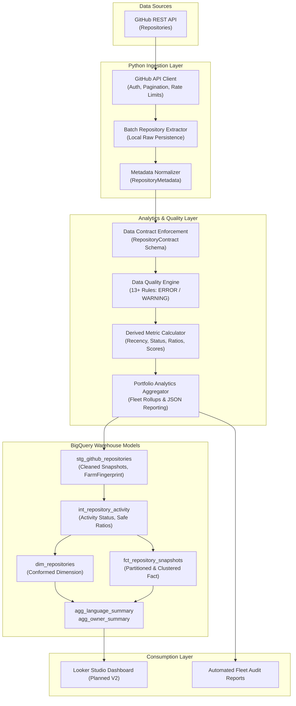

# DevFlow Intelligence

[](https://www.python.org/downloads/)
[](https://github.com/astral-sh/ruff)
[](https://docs.pytest.org/)
[](https://cloud.google.com/bigquery)

**DevFlow Intelligence** is a V1 batch Data Engineering and Analytics platform that extracts, validates, transforms, and analyzes public GitHub repository metadata. It runs locally end to end and includes a mock-tested BigQuery adapter plus warehouse-ready SQL models.

It provides engineering leadership and technical leads with reliable, standardized, and auditable metrics regarding repository maintenance health, community interest, and technology stack distributions across multi-repository fleets.

---

## Architecture Overview



---

## Key Highlights & Portfolio Value

1. **Strict Data Contract Architecture**: Enforces explicit schema types, nullability boundaries, and timezone awareness (`UTC`) via `RepositoryContract`, insulating downstream models from upstream API drift.
2. **Programmatic Data Quality Gate**: Non-destructive `DataQualityEngine` evaluating 16 record- and batch-level rules with clear severity tiers (`ERROR` vs `WARNING`), preventing corrupt records from polluting analytical marts.
3. **Deterministic Derived Metrics**: Recency calculations (`days_since_last_push`, `recency_bucket`), age (`repository_age_days`), and activity status mappings (`ACTIVE`, `STALE`, `INACTIVE`, `ARCHIVED`, `DISABLED`) execute deterministically relative to ingestion watermarks.
4. **Cloud Warehouse Readiness (Google BigQuery)**: A typed, mock-tested insert adapter and SQL models preserve snapshots, derive 64-bit `FARM_FINGERPRINT` keys, and define partitioning and clustering strategies. Real cloud execution remains environment-dependent.
5. **Dual-Team Autonomous Collaboration**: Developed under a strict isolation model where the Analytics & Quality foundation is decoupled from the Data Platform ingestion layer.
6. **Zero-Dependency Analytics Core**: Analytics and data quality engines rely on Python standard library dataclasses, enums, and typing; the complete offline suite also covers ingestion, orchestration, CI contracts, and the cloud adapter.

---

## Business Problem & Metric Definitions

Engineering managers overseeing multiple repositories require centralized visibility into maintenance activity, open issue volumes, and repository freshness. DevFlow Intelligence provides mathematically sound and defensible answers to core questions:

### 1. Activity Status & Recency Classification
* **`ACTIVE`**: Repository pushed within the last 90 days, not archived, not disabled. (Note: 90/180-day thresholds are internal analytical rules, not GitHub standards).
* **`STALE`**: Repository pushed between 91 and 180 days ago.
* **`INACTIVE`**: Repository without pushes in > 180 days or without any recorded pushes.
* **`ARCHIVED`**: Explicitly marked archived by owner.
* **`DISABLED`**: Explicitly disabled repository.
* **`recency_bucket`**: Categorized time window of last push (`LAST_7_DAYS`, `LAST_30_DAYS`, `LAST_90_DAYS`, `LAST_180_DAYS`, `OVER_180_DAYS`, `NEVER_PUSHED`).

### 2. Community & Technical Ratios
* **`fork_to_star_ratio`**: Compares the volume of repository forks to stars (does not guarantee code contribution).
* **`issue_to_star_ratio`**: Identifies repositories with disproportionate issue backlogs relative to star base.
* **`issue_to_fork_ratio`**: Relates issue volume to active fork maintenance.
* **`issue_density_per_mb`**: Evaluates backlog density normalized by repository codebase size (MB).
* **`repository_age_days`**: Elapsed lifetime of repository from creation to extraction.
* **`community_interest_score`**: Weighted composite metric:
  $$\text{Score} = (\text{stars} \times 1.0) + (\text{forks} \times 2.0) + (\text{subscribers} \times 1.5)$$
* **`size_category`**: Standardized size tiering (`EMPTY`, `MICRO`, `SMALL`, `MEDIUM`, `LARGE`).

---

## Data Quality Framework

The pipeline implements an automated data quality gate distinguishing between fatal contract breaches and operational observations:

| Severity | Action | Examples |
|---|---|---|
| **`ERROR`** | Rejects or flags record as invalid; halts analytical promotion | Negative stars/forks, invalid repository ID, empty owner/name, identity mismatch between full_name and owner, missing `extracted_at`, batch duplicates |
| **`WARNING`** | Records operational observation; allows processing | `pushed_at` earlier than `created_at`, non-standard URL scheme |
| **`INFO`** | Diagnostic tracking | Default values applied, volume distributions |

Run the quality diagnostic suite:
```powershell
python scripts/check_data_quality.py
```

---

## BigQuery SQL Warehouse Models

Located in `analytics/sql/`:

* **`staging/stg_github_repositories.sql`**: Type-casts raw snapshots, applies null handling, and generates `repository_surrogate_key` via `FARM_FINGERPRINT`.
* **`intermediate/int_repository_activity.sql`**: Calculates temporal delays and ratios with zero-safe `SAFE_DIVIDE` semantics aligned with Python.
* **`marts/dim_repositories.sql`**: Selects the latest snapshot for each conformed repository dimension row.
* **`marts/fct_repository_snapshots.sql`**: Daily snapshot fact table partitioned by `DATE(snapshot_timestamp)` and clustered by `(repository_id, language)`.
* **`marts/agg_language_summary.sql`**: Aggregated fleet metrics segmented by programming language.
* **`marts/agg_owner_summary.sql`**: Aggregated portfolio metrics segmented by repository owner.

---

## Repository Structure

```text
devflow-engineering-analytics/
├── analytics/                      # Analytics & Quality Layer
│   ├── contracts/                  # Schema contract definitions & validation
│   │   ├── repository.py           # RepositoryContract & RepositoryRecord
│   ├── metrics/                    # Derived metric calculations & fleet aggregation
│   │   ├── calculator.py           # RepositoryMetricCalculator
│   │   ├── definitions.py          # RepositoryMetrics & ActivityStatus
│   │   └── summary.py              # PortfolioAnalyticsAggregator & PortfolioSummary
│   ├── quality/                    # Programmatic Data Quality Framework
│   │   ├── engine.py               # DataQualityEngine
│   │   ├── models.py               # QualityResult, QualityIssue, QualitySeverity
│   │   └── rules.py                # 16 validation rules (Record & Batch)
│   ├── sql/                        # BigQuery-ready SQL warehouse models
│   │   ├── staging/                # stg_github_repositories.sql
│   │   ├── intermediate/           # int_repository_activity.sql
│   │   ├── marts/                  # dim_repositories, fct_snapshots, aggs
│   │   └── README.md               # SQL modeling & optimization guide
│   └── service.py                  # High-level analytical facade API
├── docs/                           # Technical architecture & project documentation
│   ├── analytics/                  # Deep-dive analytics, DQ, and warehouse guides
│   ├── architecture/               # System architecture & ADRs
│   ├── integration_acceptance_checklist.md # Integration contract & boundaries
│   └── project_scope.md            # Business problem & project scope
├── ingestion/                      # GitHub API extraction client & metadata
│   ├── bigquery/                   # Mock-tested BigQuery repository sink
│   ├── common/                     # Config, logging, sink protocol
│   └── github/                     # Client, service, batch, metadata
├── orchestration/                  # Local end-to-end pipeline and stage results
├── scripts/                        # Operational CLI diagnostic scripts
│   ├── check_analytics.py          # Analytics pipeline diagnostic runner
│   ├── check_data_quality.py       # Data quality validation diagnostic runner
│   ├── check_environment.py        # Python runtime & dependencies verification
│   ├── check_github_connection.py  # GitHub API connectivity test
│   └── run_devflow.py              # End-to-end pipeline entrypoint
├── tests/                          # Offline automated test suite
│   ├── test_analytics_*.py         # Analytics service & summary unit tests
│   ├── test_contract_*.py          # Data contract validation tests
│   ├── test_data_quality_*.py      # Data quality rule & engine tests
│   └── test_metrics_*.py           # Metric calculation & ratio tests
├── .github/workflows/ci.yml        # Compile, Ruff, and pytest gates
├── pyproject.toml                  # Pytest & Ruff configurations
└── README.md                       # Main project documentation
```

---

## Getting Started

### 1. Prerequisites
* Python $\ge 3.12$ (Tested on Python 3.14.6)
* Git

### 2. Environment Setup
```powershell
# Clone or navigate to the repository
cd C:\DataEngineering\devflow-engineering-analytics

# Create and activate virtual environment
python -m venv .venv
.\.venv\Scripts\Activate.ps1

# Install development dependencies
python -m pip install -r requirements-dev.txt
```

### 3. Verify Environment & Diagnostics
```powershell
# Run environment verification
python scripts/check_environment.py

# Run analytics diagnostic
python scripts/check_analytics.py

# Run data quality test runner
python scripts/check_data_quality.py

# Run extraction, quality, analytics, and manifest generation
python -m scripts.run_devflow --config config/repositories.example.json --output-root data
```

### 4. Run Automated Test Suite
All tests execute without network calls, GitHub tokens, or cloud credentials:
```powershell
# Run the complete offline pytest suite
python -m pytest

# Run Ruff linter and code formatter check
python -m ruff check .
python -m ruff format --check .
```

---

## Security & Reliability Principles

* **Zero Secret Exposure**: The repository strictly excludes credentials, `.env` files, and GCP service account keys. API tokens are ingested via environment variables (`GITHUB_TOKEN`).
* **Offline Determinism**: No network dependencies inside unit or analytical tests. Synthetic fixtures ensure 100% reproducible test runs in any CI/CD environment.
* **Idempotency**: Run IDs and deterministic output paths prevent silent local overwrite; BigQuery insert IDs provide best-effort retry deduplication.

---

## Roadmap & Next Steps

- [x] Ingestion baseline: GitHub REST API client & metadata normalization (`DFI-006.1`)
- [x] Analytics layer: Data contract enforcement & schema reflection (`RepositoryContract`)
- [x] Analytics layer: Derived recency, community interest ratios, and fleet aggregations (`PortfolioSummary`)
- [x] Data quality layer: Programmatic rule engine with ERROR/WARNING classification (16 rules)
- [x] SQL Modeling: BigQuery-ready staging, intermediate, and dimensional marts
- [x] Comprehensive offline unit, integration, contract, regression, and warehouse acceptance suite
- [x] Integration preparation: Acceptance checklist defined (`docs/integration_acceptance_checklist.md`)
- [x] Pipeline Integration: Local raw/normalized persistence, manifests, analytics reports, and mock-tested BigQuery adapter
- [x] V1 orchestration: Reproducible Python entrypoint with run context and stage status
- [x] CI Pipeline: GitHub Actions compilation, Ruff, and pytest gates
- [ ] Managed scheduling: Airflow/Dagster deployment (optional V2)
- [ ] BI Dashboard: Looker Studio analytical dashboards querying BigQuery marts (planned)
