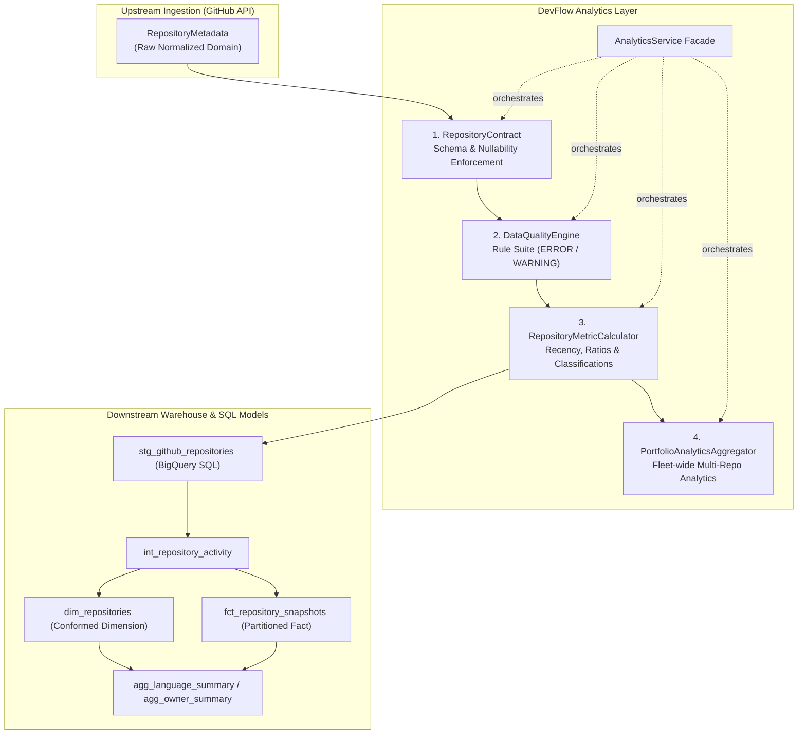

# DevFlow Intelligence — Analytics Layer Architecture

## 1. Purpose and Overview

The **Analytics Layer** in DevFlow Intelligence is the implemented analytical contract, quality gate, and derived-metrics engine for GitHub metadata. BigQuery SQL and Looker Studio appear here as target-state consumers: the SQL is static-tested, while no BigQuery dataset or Looker Studio dashboard is deployed.

It transforms point-in-time operational metadata into structured, reproducible analytical records with derived activity indicators, technical ratios, and fleet aggregations.



---

## 2. Architectural Principles

1. **Explicit Data Contracts**: Upstream API changes or schema drift cannot silently propagate. Records are validated against an immutable analytical contract schema (`RepositoryContract`).
2. **Non-Destructive Quality Gates**: The `DataQualityEngine` evaluates data integrity without mutating incoming records. Errors halt or isolate tainted records; warnings flag anomalies.
3. **Reproducibility & Determinism**: All temporal calculations (e.g. `days_since_last_push`) evaluate relative to `extracted_at` unless explicitly overridden, eliminating non-deterministic temporal drift across execution environments.
4. **Separation of Concerns**: Python implements contract enforcement, programmatic validation, and local summary analytics. The BigQuery SQL files design warehouse transformations, incremental materializations, and partitioning/clustering; live execution remains unverified.
5. **Zero External Framework Overhead**: The analytics engine utilizes standard Python library primitives (`dataclasses`, `datetime`, `enum`, `statistics`, `typing`), maximizing execution speed and eliminating brittle framework dependencies.

---

## 3. Data Contract Specification

The analytical contract enforces explicit typing, non-emptiness, and timezone semantics.

| Field Name | Type | Nullable | Primary Key | Description |
|---|---|---|---|---|
| `repository_id` | `int` | No | Yes | GitHub unique repository ID (> 0) |
| `repository_name` | `str` | No | No | Short repository name |
| `full_name` | `str` | No | Yes | Canonical identity formatted as `owner/repo` |
| `owner_login` | `str` | No | No | Owner username or organization name |
| `description` | `str` | Yes | No | Repository descriptive text |
| `visibility` | `str` | No | No | Domain constrained: `public`, `private`, `internal` |
| `default_branch` | `str` | No | No | Default git branch (e.g., `main`, `master`) |
| `language` | `str` | Yes | No | Primary language name |
| `is_fork` | `bool` | No | No | Flag indicating if repository is a fork |
| `is_archived` | `bool` | No | No | Flag indicating repository archive state |
| `is_disabled` | `bool` | No | No | Flag indicating repository disabled state |
| `created_at` | `datetime` | No | No | UTC timezone-aware repository creation timestamp |
| `updated_at` | `datetime` | No | No | UTC timezone-aware metadata update timestamp |
| `pushed_at` | `datetime` | Yes | No | UTC timezone-aware last commit push timestamp |
| `stars_count` | `int` | No | No | Non-negative star count |
| `forks_count` | `int` | No | No | Non-negative fork count |
| `open_issues_count` | `int` | No | No | Non-negative open issues and pull requests count |
| `subscribers_count` | `int` | No | No | Non-negative watcher count |
| `size_kb` | `int` | No | No | Non-negative repository disk size in KB |
| `html_url` | `str` | No | No | Valid web address URL |
| `extracted_at` | `datetime` | No | No | UTC timezone-aware pipeline ingestion timestamp |

---

## 4. Derived Analytical Metrics

### 4.1 Temporal Recency & Maintenance Status
* **`days_since_last_push`**:
  $$\text{days\_since\_last\_push} = \max(0, (\text{extracted\_at} - \text{pushed\_at}).\text{days})$$
* **`days_since_creation`** / **`repository_age_days`**:
  $$\text{repository\_age\_days} = \max(0, (\text{extracted\_at} - \text{created\_at}).\text{days})$$
* **`recency_bucket`** Classification:
  * **`NEVER_PUSHED`**: If `pushed_at is None`
  * **`LAST_7_DAYS`**: If $\text{days\_since\_last\_push} \le 7$
  * **`LAST_30_DAYS`**: If $8 \le \text{days\_since\_last\_push} \le 30$
  * **`LAST_90_DAYS`**: If $31 \le \text{days\_since\_last\_push} \le 90$
  * **`LAST_180_DAYS`**: If $91 \le \text{days\_since\_last\_push} \le 180$
  * **`OVER_180_DAYS`**: If $\text{days\_since\_last\_push} > 180$
* **`activity_status`** Classification (Note: 90 and 180-day thresholds are internal analytical rules, not official GitHub standards):
  * **`DISABLED`**: If `is_disabled == True`
  * **`ARCHIVED`**: If `is_archived == True`
  * **`INACTIVE`**: If `pushed_at is None` or `days_since_last_push > 180`
  * **`STALE`**: If $91 \le \text{days\_since\_last\_push} \le 180$
  * **`ACTIVE`**: If $\text{days\_since\_last\_push} \le 90$

### 4.2 Defensible Community & Technical Ratios
* **`fork_to_star_ratio`**:
  $$\text{fork\_to\_star\_ratio} = \frac{\text{forks\_count}}{\text{stars\_count}} \quad (\text{if } \text{stars\_count} > 0, \text{ else } 0.0)$$
* **`issue_to_star_ratio`**:
  $$\text{issue\_to\_star\_ratio} = \frac{\text{open\_issues\_count}}{\text{stars\_count}} \quad (\text{if } \text{stars\_count} > 0, \text{ else } 0.0)$$
* **`star_to_fork_ratio`**:
  $$\text{star\_to\_fork\_ratio} = \frac{\text{stars\_count}}{\text{forks\_count}} \quad (\text{if } \text{forks\_count} > 0, \text{ else } 0.0)$$
* **`issue_to_fork_ratio`**:
  $$\text{issue\_to\_fork\_ratio} = \frac{\text{open\_issues\_count}}{\text{forks\_count}} \quad (\text{if } \text{forks\_count} > 0, \text{ else } 0.0)$$
* **`issue_density_per_mb`**:
  $$\text{issue\_density\_per\_mb} = \frac{\text{open\_issues\_count}}{\text{size\_kb} / 1024.0} \quad (\text{if } \text{size\_kb} > 0, \text{ else } 0.0)$$
* **`community_interest_score`**: Composite weighted popularity index:
  $$\text{score} = (\text{stars} \times 1.0) + (\text{forks} \times 2.0) + (\text{subscribers} \times 1.5)$$
* **`size_category`**:
  * `EMPTY`: $0\text{ KB}$
  * `MICRO`: $1 \text{ to } 100\text{ KB}$
  * `SMALL`: $101 \text{ to } 10,000\text{ KB}$ ($\le 10\text{ MB}$)
  * `MEDIUM`: $10,001 \text{ to } 100,000\text{ KB}$ ($\le 100\text{ MB}$)
  * `LARGE`: $> 100,000\text{ KB}$ ($> 100\text{ MB}$)

---

## 5. Multi-Repository Fleet Aggregations

The `PortfolioAnalyticsAggregator` combines individual `RepositoryMetrics` to produce fleet-wide executive summaries:

* **Aggregated Fleet Counters**: Total/average/median stars, forks, issues, watchers, and disk volume.
* **Health Breakdown**: Counts and percentages of active, stale, inactive, archived, and disabled repositories.
* **Governance & Origin Breakdown**: Counts and percentages of forks vs source repositories, public/private/internal visibility distribution, and archived repositories.
* **Recency Distribution**: Frequency distribution of repositories categorized across `RecencyBucket` windows.
* **Language Distribution**: Repository counts, fleet percentages, cumulative stars, and active repository counts grouped by primary programming language.
* **Owner Distribution**: Multi-repository ownership breakdown, total reach (stars/forks), and language diversity per organization or user.
* **Leaderboards**: Top starred repositories across the fleet.

---

## 6. Programmatic Usage

```python
from analytics.service import AnalyticsService

service = AnalyticsService()

# Evaluate batch, check quality, compute metrics, and aggregate portfolio
metrics, quality_result, portfolio = service.process_batch(raw_records)

if not quality_result.is_valid:
    print(f"Data quality errors detected: {quality_result.error_count}")
    for issue in quality_result.get_issues_by_severity(QualitySeverity.ERROR):
        print(f"  - {issue.rule_id} ({issue.field}): {issue.message}")

# Generate serializable analytical summary
report_dict = service.generate_report(raw_records)
```
