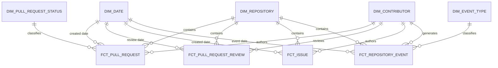
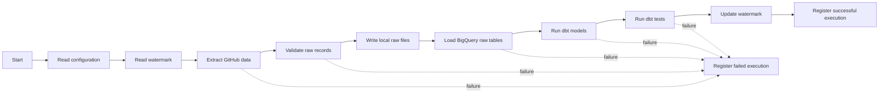

# DevFlow Intelligence — System Architecture

## 1. Architecture purpose

This document describes how DevFlow Intelligence collects, stores, transforms, validates and exposes public GitHub engineering activity.

The architecture is designed as a daily batch pipeline focused on:

* Reproducibility.
* Traceability.
* Incremental processing.
* Data quality.
* Clear separation of responsibilities.
* Local development using accessible tools.

---

## 2. High-level architecture

```mermaid
flowchart LR
    subgraph SOURCES["Data Sources"]
        GHAPI["GitHub REST API"]
        GHARCHIVE["GH Archive hourly JSON.GZ files"]
    end

    subgraph INGESTION["Python Ingestion Layer"]
        CLIENT["GitHub API Client"]
        DOWNLOADER["GH Archive Downloader"]
        VALIDATOR["Schema and Record Validation"]
        METADATA["Ingestion Metadata Generator"]
    end

    subgraph LANDING["Local Raw Landing Zone"]
        JSON["Raw JSON and JSONL files"]
        MANIFEST["Ingestion Manifest"]
    end

    subgraph BIGQUERY["Google BigQuery"]
        RAW["devflow_raw"]
        AUDIT["devflow_audit"]
        STAGING["devflow_staging"]
        ANALYTICS["devflow_analytics"]
    end

    subgraph DBT["dbt Transformation Layer"]
        STG_MODELS["Staging Models"]
        INT_MODELS["Intermediate Models"]
        CORE_MODELS["Facts and Dimensions"]
        MART_MODELS["Analytical Marts"]
        TESTS["Data Quality Tests"]
    end

    subgraph ORCHESTRATION["Orchestration"]
        AIRFLOW["Apache Airflow DAGs"]
    end

    subgraph CONSUMPTION["Data Consumption"]
        LOOKER["Looker Studio Dashboard"]
        DOCS["dbt Documentation"]
    end

    GHAPI --> CLIENT
    GHARCHIVE --> DOWNLOADER

    CLIENT --> VALIDATOR
    DOWNLOADER --> VALIDATOR
    VALIDATOR --> METADATA

    METADATA --> JSON
    METADATA --> MANIFEST

    JSON --> RAW
    MANIFEST --> AUDIT

    RAW --> STG_MODELS
    STG_MODELS --> STAGING

    STAGING --> INT_MODELS
    INT_MODELS --> CORE_MODELS
    CORE_MODELS --> ANALYTICS
    CORE_MODELS --> MART_MODELS
    MART_MODELS --> ANALYTICS

    TESTS --> STAGING
    TESTS --> ANALYTICS

    ANALYTICS --> LOOKER
    ANALYTICS --> DOCS

    AIRFLOW -. orchestrates .-> CLIENT
    AIRFLOW -. orchestrates .-> DOWNLOADER
    AIRFLOW -. triggers .-> STG_MODELS
    AIRFLOW -. triggers .-> TESTS
    AIRFLOW -. records execution .-> AUDIT
```



---

## 3. Data flow

The pipeline processes data through the following sequence:

```text
GitHub REST API / GH Archive
              ↓
        Python extraction
              ↓
     Local raw file storage
              ↓
        BigQuery raw layer
              ↓
         dbt staging layer
              ↓
      dbt intermediate layer
              ↓
   Facts, dimensions and marts
              ↓
         Data quality tests
              ↓
      Looker Studio dashboard
```

---

## 4. Architecture components

### 4.1 GitHub REST API

The GitHub REST API provides detailed information about:

* Repositories.
* Pull requests.
* Pull request reviews.
* Issues.

The ingestion client will be responsible for:

* Authentication.
* Pagination.
* HTTP timeouts.
* Retry handling.
* Rate-limit handling.
* Response validation.
* Extraction metadata.

The API token will be obtained from an environment variable and will never be stored in the repository.

Expected environment variable:

```text
GITHUB_TOKEN
```

---

### 4.2 GH Archive

GH Archive provides compressed hourly files containing public GitHub events.

The pipeline will process selected event types:

* `PullRequestEvent`
* `PushEvent`
* `IssuesEvent`
* `IssueCommentEvent`
* `ReleaseEvent`

The downloader will:

1. Generate the expected file URL.
2. Download the compressed file.
3. Validate that the download completed.
4. Calculate a SHA-256 file hash.
5. Skip files that were already processed.
6. Filter events belonging to configured repositories.
7. Write filtered records as JSON Lines.

The complete GitHub event history will not be processed.

---

### 4.3 Python ingestion layer

Python will contain the extraction and loading logic.

Expected modules:

```text
ingestion/
├── common/
│   ├── config.py
│   ├── logging.py
│   ├── exceptions.py
│   └── metadata.py
├── github/
│   ├── client.py
│   ├── repositories.py
│   ├── pull_requests.py
│   ├── reviews.py
│   └── issues.py
├── gharchive/
│   ├── downloader.py
│   ├── reader.py
│   └── filters.py
└── loaders/
    └── bigquery_loader.py
```

The ingestion layer must not contain analytical business metrics.

Its responsibilities are limited to:

* Extracting source data.
* Performing basic source validation.
* Adding technical metadata.
* Preserving raw payloads.
* Loading records into the raw layer.

---

### 4.4 Local raw landing zone

Before loading data into BigQuery, the pipeline will preserve a local copy of the extracted records.

Expected structure:

```text
data/
└── raw/
    ├── github_api/
    │   ├── repositories/
    │   ├── pull_requests/
    │   ├── reviews/
    │   └── issues/
    └── gharchive/
        └── events/
```

Files should be organized by extraction date and repository when applicable.

Example:

```text
data/raw/github_api/pull_requests/
└── extraction_date=2026-07-14/
    └── repository=apache_airflow/
        └── pull_requests.jsonl
```

The landing zone provides:

* Debugging support.
* Reprocessing capability.
* Traceability.
* Separation between extraction and cloud loading.

Large raw files will not be committed to Git.

---

## 5. BigQuery datasets

The project will use four logical datasets.

### 5.1 `devflow_raw`

Purpose:

* Preserve source-level records.
* Store source payloads.
* Add ingestion metadata.
* Support reprocessing and auditing.

Expected tables:

```text
raw_repositories
raw_pull_requests
raw_pull_request_reviews
raw_issues
raw_github_events
```

Common technical fields:

```text
source_system
source_endpoint
source_file
ingestion_timestamp
pipeline_run_id
record_hash
raw_payload
```

Raw tables should contain minimal business transformation.

---

### 5.2 `devflow_audit`

Purpose:

* Track pipeline executions.
* Store watermarks.
* Register processed files.
* Store row counts and execution status.

Expected tables:

```text
pipeline_execution_log
pipeline_watermark
processed_file_manifest
data_quality_execution
```

This dataset represents the operational state of the pipeline.

---

### 5.3 `devflow_staging`

Purpose:

* Rename source fields.
* Convert data types.
* Normalize timestamps.
* Standardize states.
* Remove exact technical duplicates.
* Extract relevant fields from raw payloads.

Expected models:

```text
stg_github_repositories
stg_github_pull_requests
stg_github_pull_request_reviews
stg_github_issues
stg_gharchive_events
```

The staging layer must not contain final business metrics.

---

### 5.4 `devflow_analytics`

Purpose:

* Store intermediate entities.
* Store dimensions and facts.
* Calculate business metrics.
* Provide dashboard-ready tables.

Expected dimensions:

```text
dim_date
dim_repository
dim_contributor
dim_event_type
dim_pull_request_status
```

Expected facts:

```text
fct_pull_request
fct_pull_request_review
fct_issue
fct_repository_event
```

Expected marts:

```text
mart_repository_daily_metrics
mart_pull_request_performance
mart_data_quality_summary
```

---

## 6. dbt transformation layers

### 6.1 Staging

Staging models create clean and consistently named representations of source tables.

Example:

```text
raw_pull_requests
        ↓
stg_github_pull_requests
```

Permitted operations:

* Renaming.
* Type casting.
* Basic null normalization.
* State standardization.
* Raw payload extraction.
* Exact duplicate removal.

---

### 6.2 Intermediate

Intermediate models combine or reshape staging models to produce reusable business entities.

Expected models:

```text
int_pull_request_first_review
int_pull_request_lifecycle
int_issue_lifecycle
int_repository_daily_activity
```

Example:

```text
stg_github_pull_requests
          +
stg_github_pull_request_reviews
          ↓
int_pull_request_first_review
```

These models simplify complex logic before facts and marts are built.

---

### 6.3 Core dimensional models

Core models represent facts and dimensions.

A fact table stores measurable business events.

Example:

```text
fct_pull_request
```

A dimension stores descriptive context.

Example:

```text
dim_repository
```

The expected star schema is:



---

### 6.4 Analytical marts

Marts expose business-ready information.

Dashboards must query marts instead of raw tables.

Examples:

```text
mart_repository_daily_metrics
mart_pull_request_performance
```

This prevents dashboards from duplicating transformation logic.

---

## 7. Incremental processing

The pipeline will use a watermark to remember the most recent successfully processed timestamp.

Example:

```text
pipeline_name: github_pull_requests
repository_name: apache/airflow
last_successful_timestamp: 2026-07-14T00:00:00Z
```

Execution sequence:

1. Read the current watermark.
2. Extract records after the watermark.
3. Validate and load the records.
4. Execute transformations and tests.
5. Update the watermark only after successful completion.

A failed pipeline must not advance the watermark.

---

## 8. Idempotency and deduplication

The same extraction window may be executed more than once.

To prevent uncontrolled duplication, each source record will receive a deterministic hash.

Conceptual example:

```text
record_hash =
SHA256(
    source_system
    + repository_name
    + entity_id
    + updated_at
)
```

Expected behavior:

* The same entity version generates the same hash.
* Reprocessing the same batch does not duplicate that version.
* A source record updated later generates a new version when `updated_at` changes.
* Exact duplicates are removed before analytical models are built.

---

## 9. Pipeline auditing

Every execution will receive a unique identifier:

```text
pipeline_run_id
```

Minimum audit information:

```text
pipeline_run_id
pipeline_name
repository_name
started_at
finished_at
status
records_read
records_written
records_rejected
source_file
file_hash
error_message
```

Allowed execution states:

```text
STARTED
SUCCESS
FAILED
SKIPPED
```

---

## 10. Airflow orchestration

Airflow will coordinate the pipeline but will not contain transformation logic directly.

Expected daily workflow:



The watermark must only be updated after:

* Extraction succeeds.
* Loading succeeds.
* dbt models succeed.
* Data quality tests succeed.

---

## 11. Docker responsibility

Docker Compose will provide a reproducible local environment for:

* Airflow.
* Airflow metadata database.
* Scheduler.
* Web interface.
* Local pipeline execution.

BigQuery will remain an external managed service.

Docker will not be used to simulate a distributed production environment.

---

## 12. Security and configuration

Secrets must be stored outside version control.

Expected local variables:

```text
GITHUB_TOKEN
GCP_PROJECT_ID
GOOGLE_APPLICATION_CREDENTIALS
BIGQUERY_LOCATION
DEVFLOW_ENV
```

The repository will include:

```text
.env.example
```

The repository will not include:

```text
.env
credentials.json
service-account.json
private keys
access tokens
```

---

## 13. Timezone standard

All source and ingestion timestamps will be stored in UTC.

Examples:

```text
created_at
updated_at
closed_at
merged_at
submitted_at
ingestion_timestamp
```

Timezone conversion for visualization will occur only in the consumption layer when required.

---

## 14. Repository configuration

Repositories should not be hardcoded throughout the extraction code.

A central configuration will define the selected repositories.

Conceptual example:

```yaml
repositories:
  - apache/airflow
  - dbt-labs/dbt-core
  - duckdb/duckdb
  - pandas-dev/pandas
  - prefecthq/prefect
```

During initial development, only the following repository will be enabled:

```text
apache/airflow
```

---

## 15. Architectural decisions

### ADR-001 — Batch processing instead of streaming

Decision:

Use daily batch processing.

Reason:

The project analyzes historical engineering activity and does not require second-level latency.

Excluded alternatives:

* Kafka.
* Real-time event processing.
* Streaming data warehouses.

---

### ADR-002 — BigQuery as the analytical warehouse

Decision:

Use BigQuery for raw, staging, audit and analytical datasets.

Reason:

It provides managed analytical storage, SQL processing and integration with Looker Studio without requiring local database administration.

---

### ADR-003 — Preserve a local raw copy

Decision:

Store source responses locally before loading BigQuery.

Reason:

This enables debugging, replay and validation when developing the pipeline.

---

### ADR-004 — Use dbt for transformation logic

Decision:

Keep analytical SQL transformations inside dbt instead of Python.

Reason:

This separates ingestion responsibilities from analytical modeling and allows models, dependencies, tests and documentation to be managed together.

---

### ADR-005 — Use Airflow only as orchestrator

Decision:

Airflow coordinates tasks but does not implement the core extraction or transformation logic.

Reason:

Python modules and dbt models should remain independently testable and executable.

---

### ADR-006 — Dashboard consumes marts only

Decision:

Looker Studio will query analytical marts rather than raw or staging tables.

Reason:

Business metrics must be defined once and reused consistently.

---

## 16. Failure handling strategy

Expected behaviors:

| Failure                | Pipeline behavior                               |
| ---------------------- | ----------------------------------------------- |
| Temporary API failure  | Retry with controlled delay                     |
| Invalid authentication | Stop extraction and register failure            |
| Rate limit reached     | Wait or stop safely without advancing watermark |
| Invalid source record  | Register rejection and continue when safe       |
| BigQuery load failure  | Stop downstream transformations                 |
| dbt model failure      | Do not execute dependent marts                  |
| dbt test failure       | Mark pipeline as failed                         |
| Airflow task failure   | Retry according to task configuration           |
| Partial local file     | Delete or mark as incomplete                    |
| Duplicate execution    | Skip or deduplicate safely                      |

---

## 17. Architecture boundaries

The MVP will not include:

* Streaming infrastructure.
* Kubernetes.
* Spark.
* Terraform.
* Private repositories.
* Employee productivity rankings.
* Machine learning.
* Production Airflow hosting.
* Multi-cloud architecture.
* Event-driven microservices.

---

## 18. Expected project flow

```text
Extract
   ↓
Preserve raw data
   ↓
Load
   ↓
Standardize
   ↓
Model
   ↓
Test
   ↓
Publish
   ↓
Audit
```

Each stage must be independently understandable and testable.
